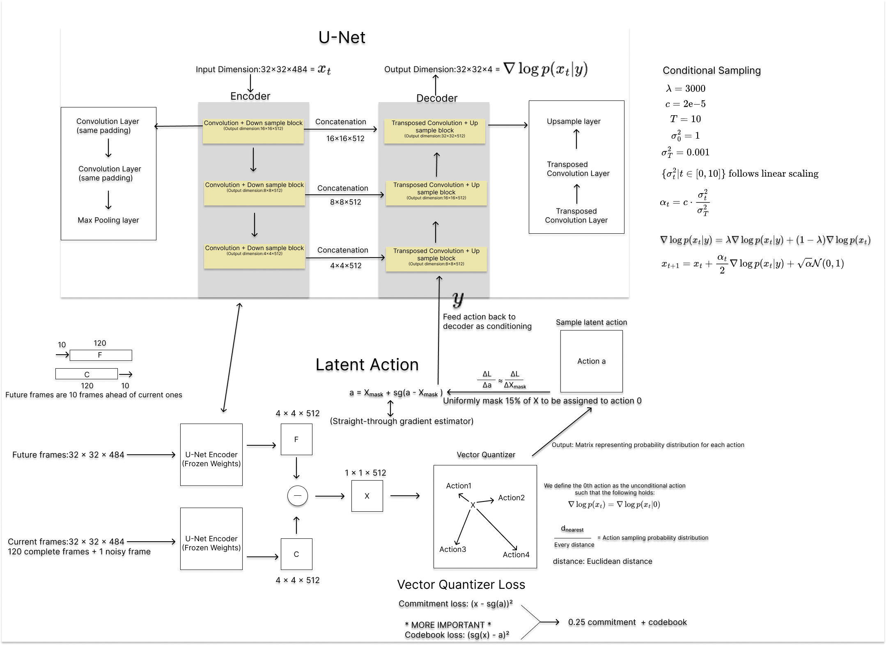

# Dynamic Environment Generation in Classic Video Games Using Video Diffusion and Latent Action Models

#### Contributors

- Nuo Wen Lei (nlei)
- Haiyang Wang (hwang330)
- Jingbo Yang (jyang113)

#### Model Architecture

#### Important Links:

- [Project Drive](https://drive.google.com/drive/u/1/folders/10sVDeDwl1yXm8iJd95UBQhUD-DNItSTW)
- [Devpost Submission](https://devpost.com/software/dynamic-environment-generation-in-classic-video-games)
- [Presentation Slides](https://docs.google.com/presentation/d/1hOJnl-PbjXrF3eY9vKQ5zDR99oZB2fGN-K3jKSVAEoA/edit#slide=id.p)

#### Important Files:

- `unguided_diffusion/diffusion.py` : Unguided and Latent Action Video Diffusion implementations
- `vqvae/quantizers.py` : Latent Action Vector Quantizer implementation
- `ccv_action_trainer.py` : File for training the Latent Action Video Diffusion model
- `ccv_trainer.py` : File for training the Unguided Video Diffusion model
- `constants.py` : All adjustable hyperparameters for the model

#### Summary

We use the pretrained VAE Image Auto-encoders from Keras-CV to preprocess the game frames to a decodable latent space.

- [Image Encoder](https://github.com/keras-team/keras-cv/blob/master/keras_cv/src/models/stable_diffusion/image_encoder.py)
- [Image Decoder](https://github.com/keras-team/keras-cv/blob/master/keras_cv/src/models/stable_diffusion/decoder.py)

We re-implement the [Classic U-Net](https://arxiv.org/abs/1505.04597) introduced in 2015 in the `unguided_diffusion/` folder, however we train it in a pretrained Stable Diffusion Latent Space in order to reduce the model size. Then we use a method called "frame-stacking" as outlined in [Diffusion World Model](https://openreview.net/pdf?id=bAXmvOLtjA) to do frame-by-frame **unguided** video diffusion. The original frame-stacking model used a [classic U-Net](https://arxiv.org/abs/1505.04597) directly in the pixel space, which resulted in an architecture with 122 million parameters. We reduce the number of trainable parameters to 65 million parameters by training in a pretrained latent space.

Additionally, we implement the core innovation of our project inspired by [VQ-VAE](https://arxiv.org/pdf/1711.00937) and [Genie](https://arxiv.org/pdf/2402.15391), which is a Vector Quantizer Encoder that quantizes useful future information into discrete actions and uses the quantized actions to condition our previously unconditional diffusion model. Our implementation of the Vector Quantizer is in the `vqvae/` folder and our final `LatentActionVideoDiffusion` model is in the `unguided_diffusion/diffusion.py` file.

#### Technology Used

- TensorFlow package (same environment as class conda environment csci1470)
- Keras / Keras-CV pretrained Image Encoder and Decoder
- Vector Quantizer initially adapted from [Deepmind Sonnet](https://github.com/google-deepmind/sonnet/blob/v1/sonnet/python/modules/nets/vqvae.py) implementation
